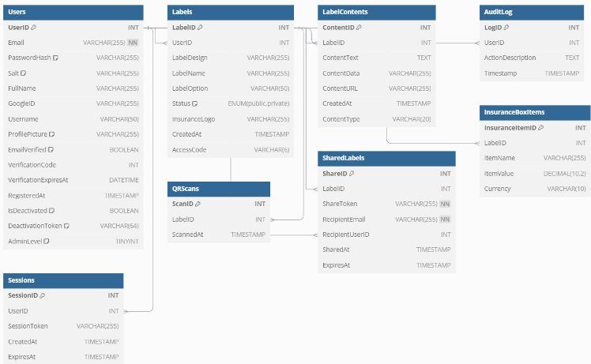

# MoveOut Project

MoveOut is a web-based platform designed to help users organize and manage their moving process by creating customizable labels for moving boxes. The platform provides features such as label creation with text, image, or audio content, secure label sharing via QR codes, and specialized insurance labels.

## Table of Contents
- [Features](#features)
- [Technologies Used](#technologies-used)
- [Installation](#installation)
- [Usage](#usage)
- [ER Diagram](#er-diagram)
- [License](#license)

## Features
- **User Registration**: Secure user registration with email verification or Google OAuth integration.
- **Label Creation**: Create labels with text, image, or audio content to describe the contents of moving boxes.
- **QR Codes**: Each label has an associated QR code, allowing users to quickly view details by scanning.
- **Secure Label Sharing**: Share labels with others securely using a PIN-based access system.
- **Insurance Labels**: Create specialized labels for insured items, listing item details and values in various currencies.
- **Account Management**: Update or deactivate user profiles, with inactive profiles being automatically deactivated after a month.

## Technologies Used
- **Frontend**:
  - EJS: Dynamic HTML rendering.
  - CSS: Styling for the user interface.
- **Backend**:
  - Node.js & Express: Server-side logic and routing.
  - SQL (MySQL): Database for managing users, labels, and content.
- **Additional Tools**:
  - **QR Code Generation**: Makes labels scannable for easy access.
  - **Security**: Password hashing, PIN-based sharing.
  - **Version Control**: Git for version control and collaboration.

## Installation

To run the MoveOut project locally, follow these steps:

1. **Install Node.js and npm**:
   
   First, you need to install Node.js and npm (Node Package Manager). Follow the instructions below for your operating system:

   - **Windows**:
     1. Visit the [Node.js download page](https://nodejs.org/).
     2. Download the Windows installer and follow the installation steps.
     3. Verify the installation by running the following commands in Command Prompt:
        ```bash
        node -v
        npm -v
        ```

   - **macOS**:
     1. Install [Homebrew](https://brew.sh/) if you don't have it:
        ```bash
        /bin/bash -c "$(curl -fsSL https://raw.githubusercontent.com/Homebrew/install/HEAD/install.sh)"
        ```
     2. Use Homebrew to install Node.js:
        ```bash
        brew install node
        ```
     3. Verify the installation by running:
        ```bash
        node -v
        npm -v
        ```

   - **Linux**:
     1. Update your package list and install Node.js:
        ```bash
        sudo apt update
        sudo apt install nodejs npm
        ```
     2. Verify the installation by running:
        ```bash
        node -v
        npm -v
        ```

2. **Install MariaDB**:

   To use MariaDB as the database for this project, follow the instructions below for your operating system:

   - **Windows**:
     1. Download the MariaDB installer from the [official website](https://mariadb.org/download/).
     2. Run the installer and follow the installation steps.

   - **macOS**:
     1. Install MariaDB using Homebrew:
        ```bash
        brew install mariadb
        ```
     2. Start the MariaDB service:
        ```bash
        brew services start mariadb
        ```

   - **Linux**:
     1. Update your package list and install MariaDB:
        ```bash
        sudo apt update
        sudo apt install mariadb-server
        ```
     2. Start the MariaDB service:
        ```bash
        sudo systemctl start mariadb
        ```

   3. **Secure the Installation**:
      Run the following command to secure your MariaDB installation and set a root password:
      ```bash
      sudo mysql_secure_installation
      ```

3. **Clone the repository**:
   
   Clone the MoveOut repository to your local machine:
   ```bash
   git clone https://github.com/Abdallah699/moveout.git
   cd moveout
   ```

4. **Install dependencies**:
   
   Install the required Node.js dependencies:
   ```bash
   npm install
   ```

5. **Configure Environment Variables and Database Configuration**:
   
   Create a `.env` file in the root directory and add the following:
   ```
   DB_HOST=your_database_host
   DB_USER=your_database_user
   DB_PASSWORD=your_database_password
   GOOGLE_CLIENT_ID=your_google_client_id
   GOOGLE_CLIENT_SECRET=your_google_client_secret
   SESSION_SECRET=your_session_secret
   ```

   Update the `config.json` file with the following configuration and replace it with your local hostname:
   ```json
   {
       "host": "localhost",
       "user": "dbadm",
       "password": "P@ssw0rd",
       "database": "moveOut",
       "multipleStatements": true,
       "googleClientID": "YOUR_ACTUAL_GOOGLE_CLIENT_ID",
       "googleClientSecret": "YOUR_ACTUAL_GOOGLE_CLIENT_SECRET"
   }
   ```
   Make sure to create a MariaDB username (`dbadm`) and set the same password (`P@ssw0rd`) as provided above.

6. **Run the Application**:
   
   Start the server by running:
   ```bash
   npm start
   ```

7. **Access the App**:
   
   Open your browser and visit `http://localhost:1339/login` to use the application.

8. **Reset the Database**:
   
   If you need to reset/setup the database, navigate to the `MoveOutProgram/sql` directory and run the following command:
   ```bash
   mariadb < reset.sql
   ```
8. **How to access the admin page**:

   First go to maria db by writing in the terminal 
   ```bash
   mariadb
   ```

   Then you have to use the database by typing
   ```bash
   use moveOut
   ```

   Then you have to pick the user you want to give admin rights to and insert the following command:
   ```bash
   UPDATE Users SET AdminLevel = 2 WHERE Email = "example@gmail.com";
   ```

## Usage

- **Register/Login**: Create an account using your email or Google.
- **Create Labels**: Use the "Create Label" feature to generate box labels with text, images, or audio.
- **Scan QR Codes**: View label details by scanning QR codes with a compatible device.
- **Share Labels**: Share labels securely by generating a PIN for access.

## ER Diagram

Below is the ER diagram that represents the database schema for the MoveOut project:



Make sure to replace `./path/to/your/er_diagram.png` with the actual path to your ER diagram image.

## License

This project is licensed under the MIT License. See the [LICENSE](LICENSE) file for more details.
